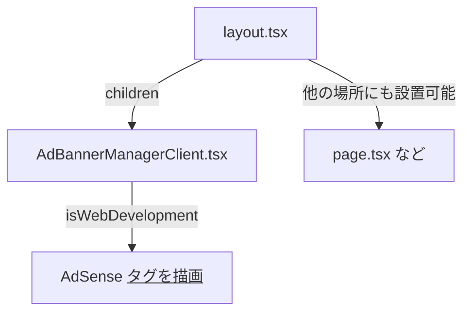

# AdSense テスト広告タグ設置計画

## 目的
Chrome DevTools の Device Toolbar で、AdSense テスト広告（`data-adtest="on"`）のバナーがどの位置に表示されるかを確認できるようにする。

---

## 設置候補と特徴

### 1. `src/app/AdBannerManagerClient.tsx` に設置（推奨）

- **特徴**: 既存のバナー広告用スペースを管理しているため、広告の位置が明確で、今後の広告管理も容易。
- **設置例**:
  ```tsx
  // AdBannerManagerClient.tsx
  if (isWebDevelopment && bannerVisible) {
    return (
      <ins
        className="adsbygoogle"
        style={{ display: "block", width: "100%", height: "60px" }}
        data-ad-client="ca-pub-XXXX"
        data-ad-slot="YYYY"
        data-ad-format="auto"
        data-full-width-responsive="true"
        data-adtest="on"
      />
    );
  }
  ```
- **備考**: 必要に応じて useEffect で `adsbygoogle.push({})` を呼び出す。

---

### 2. `src/app/layout.tsx` に設置

- **特徴**: 全ページ共通のレイアウト下部など、グローバルに広告を表示したい場合に有効。
- **設置例**:
  ```tsx
  // layout.tsx の適切な場所
  <ins
    className="adsbygoogle"
    style={{ display: "block", width: "100%", height: "60px" }}
    data-ad-client="ca-pub-XXXX"
    data-ad-slot="YYYY"
    data-ad-format="auto"
    data-full-width-responsive="true"
    data-adtest="on"
  />
  ```

---

### 3. `src/app/page.tsx` など、特定ページに設置

- **特徴**: 特定のページだけで広告表示をテストしたい場合に有効。

---

## Mermaid 図



---

## 推奨手順

1. **AdBannerManagerClient.tsx** にWeb用分岐で `<ins class="adsbygoogle" ... data-adtest="on" />` を設置
2. 必要に応じて、`layout.tsx` や `page.tsx` など他の場所にも設置可能
3. Chrome DevTools の Device Toolbar で表示位置を確認

---

## 参考

- [Google AdSense テスト広告公式ドキュメント](https://developers.google.com/adsense/management/adsense_test_ads?hl=ja)
- `data-adtest="on"` を付与することでテスト広告が表示される

---

この計画でよろしければ、実装に進むことができます。