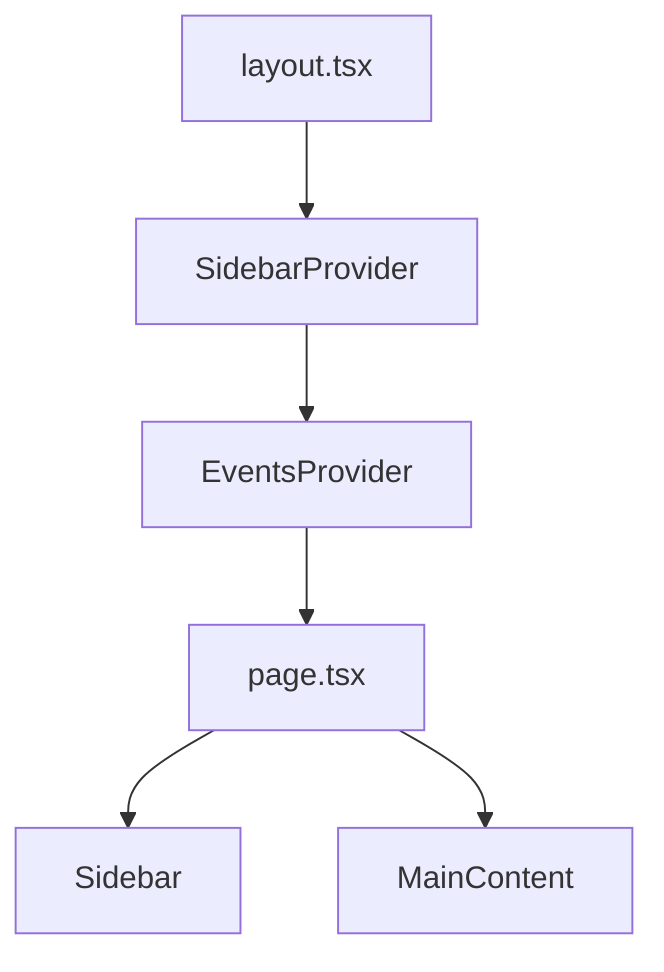

# ハンバーガーメニュー動作修正計画 v3

## 問題の詳細

タブレット端末（768px以上）でメニューボタンを押すと、イベント一覧画面全体が右にスライドしてしまう問題が発生しています。以前の修正（`SidebarProvider`をルートレイアウトに移動し、コンテキストベースのスタイリングを適用）では解決しませんでした。

## 現状の実装分析

### コンポーネント構造



### 重要なコード部分

1. **useIsMobile フック**
   ```tsx
   // src/hooks/use-mobile.tsx
   const MOBILE_BREAKPOINT = 768
   
   export function useIsMobile() {
     // 768px未満の場合のみtrueを返す
     // タブレット（768px以上）はfalseと判定される
     return !!isMobile
   }
   ```

2. **Sidebar コンポーネント（タブレット/デスクトップ用）**
   ```tsx
   // src/components/ui/sidebar.tsx
   return (
     <div
       ref={ref}
       className="group peer hidden md:block text-sidebar-foreground"
       data-state={state}
       data-collapsible={state === "collapsed" ? collapsible : ""}
       data-variant={variant}
       data-side={side}
     >
       {/* ... */}
       <div
         className={cn(
           "duration-200 fixed inset-y-0 z-10 hidden h-svh w-[--sidebar-width] transition-[left,right,width] ease-linear md:flex",
           side === "left"
             ? "left-0 group-data-[collapsible=offcanvas]:left-[calc(var(--sidebar-width)*-1)]"
             : "right-0 group-data-[collapsible=offcanvas]:right-[calc(var(--sidebar-width)*-1)]",
           // ...
         )}
       >
         {/* ... */}
       </div>
     </div>
   )
   ```

3. **メインコンテンツのスタイリング**
   ```tsx
   // src/app/page.tsx
   const mainContentClass = cn(
     "flex-1 p-4 space-y-4",
     !isMobile && "transition-[margin] duration-200 ease-linear",
     !isMobile && state === "expanded" && "mr-[--sidebar-width]",
     !isMobile && state === "collapsed" && "mr-0"
   );
   
   // ...
   
   <div className={mainContentClass}>
     {/* ... */}
   </div>
   ```

## 問題の原因

詳細な分析の結果、以下の問題点が特定されました：

1. **レイアウト構造の問題**
   - `page.tsx`のルート要素（`<div className="flex h-screen relative">`）がサイドバーとメインコンテンツを包含しているが、サイドバーが`fixed`位置指定のため、メインコンテンツがサイドバーの状態変化に適切に対応できていない

2. **スタイリングの問題**
   - メインコンテンツに適用されている`mr-[--sidebar-width]`が、サイドバーが開いたときに正しく機能していない
   - タブレット特有のレイアウト調整が不十分

3. **コンテキスト利用の問題**
   - `useSidebar`から取得した`state`に基づいてスタイリングを行っているが、状態変化が正しくスタイルに反映されていない

## 修正計画（優先度順）

### 1. メインコンテンツのスタイリング修正（優先度：高）

メインコンテンツのスタイリングを修正し、サイドバーの状態変化に適切に対応します。

```tsx
// src/app/page.tsx
const mainContentClass = cn(
  // ベースクラス
  "flex-1 p-4 space-y-4 w-full",
  
  // トランジション設定（タブレット以上のサイズで適用）
  !isMobile && "transition-all duration-300 ease-in-out",
  
  // サイドバーが開いているときのマージン設定（タブレット以上のサイズで適用）
  !isMobile && state === "expanded" && "md:mr-[--sidebar-width]",
  
  // サイドバーが閉じているときのマージン設定（タブレット以上のサイズで適用）
  !isMobile && state === "collapsed" && "md:mr-0"
);

// 使用例
return (
  <div className="relative">
    {/* ... */}
    <main 
      className={mainContentClass}
      style={{ 
        // インラインスタイルでトランジション対象を明示
        transitionProperty: 'margin-right, width' 
      }}
    >
      <h2 className="text-2xl font-bold tracking-tight">{t('Events')}</h2>
      <EventList
        events={events}
        onDelete={deleteEvent}
        onReorder={handleReorderEvents}
      />
    </main>
  </div>
);
```

### 2. レイアウト構造の修正（優先度：高）

`page.tsx`のルート要素を修正し、サイドバーとメインコンテンツの関係を明確にします。

```tsx
// src/app/page.tsx
export default function Home() {
  // 状態とフック
  const { events, setEvents, addEvent, deleteEvent } = useEvents();
  const [isCreateEventOpen, setIsCreateEventOpen] = useState(false);
  const router = useRouter();
  const { t } = useTranslation();
  const isMobile = useIsMobile();
  const { state } = useSidebar();
  
  // メインコンテンツのクラス
  const mainContentClass = cn(/* 前述のクラス定義 */);
  
  return (
    // flex-col に変更し、縦方向のレイアウトを明確に
    <div className="flex flex-col min-h-screen relative">
      {/* ハンバーガーメニューボタン - 位置固定 */}
      <div className="fixed top-4 right-4 z-50">
        <SidebarTrigger
          className="bg-background/80 backdrop-blur-sm"
          aria-label={t('Open Menu')}
        >
          <Icons.menu className="h-5 w-5" />
          <span className="sr-only">メニューを開く</span>
        </SidebarTrigger>
      </div>
      
      {/* サイドバー - 右側に配置 */}
      <Sidebar side="right">
        {/* サイドバーの内容 */}
      </Sidebar>
      
      {/* メインコンテンツ - サイドバーの状態に応じて調整 */}
      <main className={mainContentClass}>
        <h2 className="text-2xl font-bold tracking-tight">{t('Events')}</h2>
        <EventList
          events={events}
          onDelete={deleteEvent}
          onReorder={handleReorderEvents}
        />
      </main>
      
      {/* フローティングアクションボタン */}
      <Button
        className="fixed bottom-[70px] right-4 rounded-full w-12 h-12 shadow-lg z-50"
        onClick={() => setIsCreateEventOpen(true)}
      >
        <Icons.plus className="h-5 w-5" />
        <span className="sr-only">{t('Create Event')}</span>
      </Button>
      
      {/* イベント作成ダイアログ */}
      <EventCreateDialog
        open={isCreateEventOpen}
        onOpenChange={setIsCreateEventOpen}
        onEventCreated={handleCreateEvent}
      />
    </div>
  );
}
```

### 3. サイドバーコンポーネントの修正（優先度：中）

サイドバーコンポーネントを修正し、タブレット端末でのレイアウト調整を改善します。

```tsx
// src/components/ui/sidebar.tsx
// タブレット用のスタイリングを追加
const tabletStyles = cn(
  // 基本スタイル
  "md:fixed md:inset-y-0 md:z-20 md:w-[--sidebar-width] md:transition-all md:duration-300 md:ease-in-out",
  
  // 左右の位置指定
  side === "left" ? "md:left-0" : "md:right-0",
  
  // 状態に応じた位置調整
  state === "collapsed" && (
    side === "left" 
      ? "md:translate-x-[-100%]" 
      : "md:translate-x-[100%]"
  )
);

// 使用例
return (
  <div
    ref={ref}
    className={cn("group peer hidden md:block text-sidebar-foreground", tabletStyles)}
    data-state={state}
    data-collapsible={state === "collapsed" ? collapsible : ""}
    data-variant={variant}
    data-side={side}
  >
    {/* ... */}
  </div>
);
```

### 4. タブレット特有のブレークポイント追加（優先度：中）

タブレット特有のブレークポイントを追加し、より細かい制御を行います。

```tsx
// src/hooks/use-tablet.tsx
import * as React from "react"

const TABLET_MIN = 768
const TABLET_MAX = 1024

export function useIsTablet() {
  const [isTablet, setIsTablet] = React.useState<boolean | undefined>(undefined)

  React.useEffect(() => {
    const mql = window.matchMedia(`(min-width: ${TABLET_MIN}px) and (max-width: ${TABLET_MAX}px)`)
    const onChange = () => {
      setIsTablet(window.innerWidth >= TABLET_MIN && window.innerWidth <= TABLET_MAX)
    }
    mql.addEventListener("change", onChange)
    setIsTablet(window.innerWidth >= TABLET_MIN && window.innerWidth <= TABLET_MAX)
    return () => mql.removeEventListener("change", onChange)
  }, [])

  return !!isTablet
}

// 使用例
// src/app/page.tsx
const isMobile = useIsMobile();
const isTablet = useIsTablet();
const isDesktop = !isMobile && !isTablet;

const mainContentClass = cn(
  "flex-1 p-4 space-y-4 w-full",
  !isMobile && "transition-all duration-300 ease-in-out",
  // タブレット特有のスタイリング
  isTablet && state === "expanded" && "mr-[--sidebar-width]",
  isTablet && state === "collapsed" && "mr-0",
  // デスクトップ特有のスタイリング
  isDesktop && state === "expanded" && "mr-[--sidebar-width]",
  isDesktop && state === "collapsed" && "mr-0"
);
```

### 5. アニメーション調整（優先度：低）

サイドバーとメインコンテンツのアニメーションを同期させ、スムーズな遷移を実現します。

```tsx
// src/components/ui/sidebar.tsx
// 共通のトランジション設定
const TRANSITION_DURATION = 300;
const TRANSITION_EASING = "cubic-bezier(0.4, 0, 0.2, 1)"; // ease-in-out

// スタイルに適用
const transitionStyle = {
  transitionProperty: "transform, width, margin, left, right",
  transitionDuration: `${TRANSITION_DURATION}ms`,
  transitionTimingFunction: TRANSITION_EASING
};

// 使用例
return (
  <div
    style={transitionStyle}
    className={/* ... */}
  >
    {/* ... */}
  </div>
);
```

## 代替アプローチ

上記の修正計画が期待通りに機能しない場合、以下の代替アプローチも検討できます：

### 代替案1: グリッドレイアウトの使用

Flexboxの代わりにCSSグリッドを使用して、サイドバーとメインコンテンツの関係をより明確に定義します。

```tsx
// src/app/page.tsx
return (
  <div className="grid grid-cols-[1fr] md:grid-cols-[1fr_auto] min-h-screen relative">
    {/* メインコンテンツ */}
    <main className="p-4 space-y-4">
      {/* ... */}
    </main>
    
    {/* サイドバー - グリッドの2列目に配置 */}
    <Sidebar side="right">
      {/* ... */}
    </Sidebar>
    
    {/* その他の要素 */}
  </div>
);
```

### 代替案2: CSSカスタムプロパティの動的更新

JavaScriptを使用してCSSカスタムプロパティを動的に更新し、レイアウトを制御します。

```tsx
// src/app/page.tsx
React.useEffect(() => {
  // サイドバーの状態に応じてCSSカスタムプロパティを更新
  document.documentElement.style.setProperty(
    '--main-content-margin',
    state === "expanded" ? 'var(--sidebar-width)' : '0'
  );
}, [state]);

// スタイルに適用
const mainContentClass = "flex-1 p-4 space-y-4 md:mr-[var(--main-content-margin)]";
```

### 代替案3: React Portalの使用

サイドバーをReact Portalを使用して別のDOM階層にレンダリングし、メインコンテンツとの干渉を防ぎます。

```tsx
// src/components/ui/sidebar.tsx
import { createPortal } from 'react-dom';

// ...

return createPortal(
  <div className="fixed inset-y-0 right-0 z-50 w-[--sidebar-width] bg-sidebar">
    {/* ... */}
  </div>,
  document.body
);
```

## パフォーマンスとアクセシビリティの考慮

### パフォーマンス最適化

1. **不要な再レンダリングの防止**
   ```tsx
   // メモ化を使用して不要な再レンダリングを防止
   const mainContentClass = React.useMemo(() => {
     return cn(/* ... */);
   }, [isMobile, state]);
   ```

2. **トランジションの最適化**
   ```tsx
   // GPUアクセラレーションを活用
   const transitionStyle = {
     transform: 'translateZ(0)', // ハードウェアアクセラレーション
     willChange: 'transform, margin-right', // ブラウザに変更を予告
   };
   ```

### アクセシビリティの向上

1. **キーボードナビゲーション**
   ```tsx
   // サイドバートリガーにキーボードサポートを追加
   <SidebarTrigger
     aria-label={t('Open Menu')}
     aria-expanded={state === "expanded"}
     aria-controls="sidebar-content"
   >
     {/* ... */}
   </SidebarTrigger>
   
   // サイドバーコンテンツにIDを追加
   <div id="sidebar-content">
     {/* ... */}
   </div>
   ```

2. **フォーカス管理**
   ```tsx
   // サイドバーが開いたときにフォーカスを移動
   React.useEffect(() => {
     if (state === "expanded") {
       const firstFocusableElement = sidebarRef.current?.querySelector('button, [href], input, select, textarea, [tabindex]:not([tabindex="-1"])');
       (firstFocusableElement as HTMLElement)?.focus();
     }
   }, [state]);
   ```

## 実装手順

1. **メインコンテンツのスタイリング修正**
   - `src/app/page.tsx`のメインコンテンツクラスを更新
   - トランジションプロパティを明示的に設定

2. **レイアウト構造の修正**
   - `page.tsx`のルート要素を`flex-col`に変更
   - コンポーネント間の関係を明確化

3. **サイドバーコンポーネントの修正**（必要に応じて）
   - タブレット用のスタイリングを追加
   - トランジション設定を最適化

4. **タブレット特有のブレークポイント追加**（オプション）
   - `useIsTablet`フックを実装
   - より細かいデバイス制御を実現

5. **アニメーション調整**（オプション）
   - トランジション設定を同期
   - パフォーマンスを最適化

## テスト計画

1. **デバイス別テスト**
   - モバイル（<768px）: サイドバーはスライドイン、メインコンテンツは影響なし
   - タブレット（768px-1024px）: サイドバーは固定表示、メインコンテンツはマージン調整
   - デスクトップ（>1024px）: サイドバーは固定表示、メインコンテンツはマージン調整

2. **操作テスト**
   - ハンバーガーメニューボタンクリック
   - キーボードショートカット（Ctrl/Cmd+B）
   - 画面回転（縦向き/横向き）

3. **アニメーションテスト**
   - サイドバー開閉時のアニメーションがスムーズか
   - メインコンテンツの位置調整がスムーズか

4. **アクセシビリティテスト**
   - スクリーンリーダーでの操作
   - キーボードのみでの操作
   - コントラスト比の確認

## 期待される結果

- タブレット端末でメニューボタンを押しても、イベント一覧画面全体が右にスライドしない
- サイドバーの開閉に応じて、メインコンテンツが適切にマージン調整される
- アニメーションがスムーズで、ユーザー体験が向上する
- すべてのデバイスで一貫した動作を実現
- アクセシビリティが向上し、より多くのユーザーが利用可能に