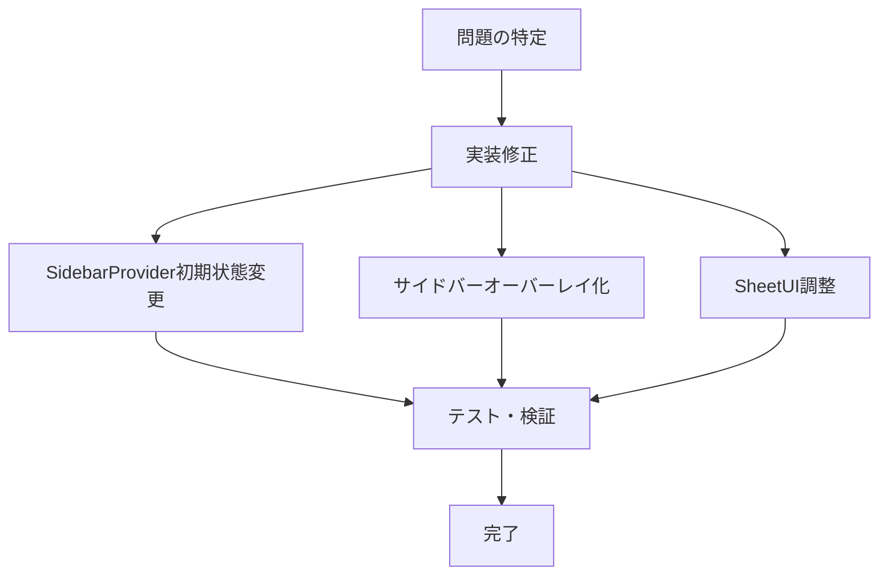

# ハンバーガーメニュー動作修正プラン

## 現状の問題

1. **初期表示時の問題**
   - 現在、ページ初期表示時にサイドバーメニューが表示されている可能性がある
   - 要望：ページロード時はイベント一覧のみが表示されるべき

2. **メインコンテンツの移動問題**
   - ハンバーガーメニュークリック時にイベント一覧全体が右側に移動してしまう
   - 要望：メインコンテンツは固定されたまま、サイドバーのみがオーバーレイとして表示されるべき

## 修正計画

### 1. SidebarProviderの初期状態の変更

`src/app/page.tsx`ファイルの修正：
- SidebarProviderの`defaultOpen`プロパティを`false`に設定し、初期状態で閉じるようにする

```jsx
<SidebarProvider defaultOpen={false}>
  {/* 既存のコード */}
</SidebarProvider>
```

### 2. サイドバーのオーバーレイモード実装

`src/components/ui/sidebar.tsx`の修正:
- サイドバーコンポーネントが画面上にオーバーレイとして表示されるよう修正
- メインコンテンツが移動しないようにCSSを更新
- スライドイン時の背景オーバーレイを追加（オプション）

```jsx
// デスクトップ版サイドバーのスタイル修正
// 以下のようなスタイルに変更
<div
  className="fixed inset-y-0 right-0 z-50 w-[--sidebar-width] transform transition-transform duration-300 ease-in-out"
  style={{ transform: state === 'expanded' ? 'translateX(0)' : 'translateX(100%)' }}
>
  {/* サイドバーコンテンツ */}
</div>
```

### 3. Sheet/ModalのUIモードの変更

`SheetContent`コンポーネントの動作調整:
- `SheetContent`が右側から表示される際にメインコンテンツを移動させないよう設定を変更
- 右側のシートが表示される際にメインコンテンツが動かないよう、css transitionを調整

```jsx
// モバイル用シートの調整
<SheetContent
  data-sidebar="sidebar"
  data-mobile="true"
  className="w-[--sidebar-width] bg-sidebar p-0 text-sidebar-foreground [&>button]:hidden fixed inset-y-0 right-0 z-50"
  style={{
    "--sidebar-width": SIDEBAR_WIDTH_MOBILE,
  } as React.CSSProperties}
  side="right"
>
  {/* シートの内容 */}
</SheetContent>
```

### 4. モバイル/デスクトップ両方での一貫したオーバーレイ挙動

- モバイルでは現状のSheet実装を維持しつつ、メインコンテンツが移動しないよう調整
- デスクトップではピア要素を動かさないようにし、サイドバーをオーバーレイとして表示



## 実装上の注意点

- z-indexの階層を適切に設定し、サイドバーが他のUIコンポーネント（特に広告バナー）の上に表示されるようにする
- トランジションアニメーションを維持して、スムーズな開閉体験を確保する
- 既存の機能（テーマ切替、ページナビゲーションなど）が引き続き正常に動作することを確認する
- どのデバイスサイズでも一貫した挙動を提供するために、レスポンシブデザインの原則を守る

この修正により、ユーザーは初期表示時にイベント一覧のみを見ることができ、ハンバーガーメニュークリック時にメインコンテンツが移動せず、サイドバーが右側からオーバーレイとして表示されるようになります。