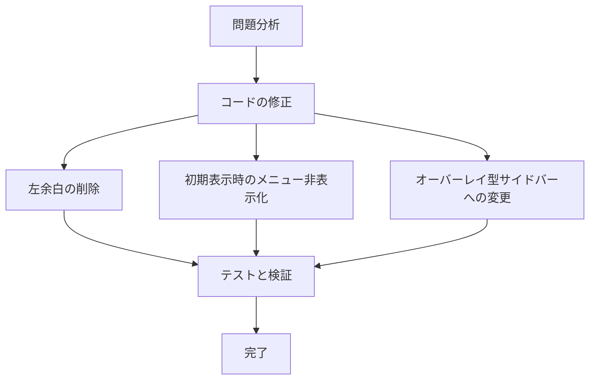

# ハンバーガーメニュー改善プラン

## 現状の問題点（スクリーンショットより）

1. **初期表示時の問題**
   - メニューが初期状態で表示されている
   - 左側に不要な余白がある
   - イベント一覧が画面の中央部分に限定されている

2. **サイドバーの動作問題**
   - ハンバーガーメニューを押すとイベント一覧が左側にスライドする
   - 要望：イベント一覧が動かず、メニューだけが右側からオーバーレイとして表示されるべき

## 修正計画

### 1. 左側余白の削除

現在のレイアウトは以下のような構造になっていると推測されます：
```
[左余白] [イベント一覧] [メニュー]
```

これを以下のように変更します：
```
[イベント一覧（画面幅いっぱい）] [オーバーレイメニュー]
```

#### 修正方法

`src/app/page.tsx`の修正：
- メインコンテンツのコンテナに適用されているパディングやマージンを削除
- 全幅レイアウトを適用し、左右の余白を取り除く

```jsx
// 変更前
<div className="container mx-auto px-4">
  <EventList />
</div>

// 変更後
<div className="w-full">
  <EventList />
</div>
```

### 2. 初期表示時のメニュー非表示化

サイドバー/シートの初期状態を「閉じている」状態に設定します。

#### 修正方法

`src/components/ui/sidebar.tsx`または該当コンポーネントの初期状態を変更：
```jsx
// 変更前
const [isOpen, setIsOpen] = useState(true); // 現在はtrueになっている可能性

// 変更後
const [isOpen, setIsOpen] = useState(false); // 初期状態を閉じた状態に
```

### 3. オーバーレイ型サイドバーの実装

現在のサイドバーは「push」モードで実装されており、開くとメインコンテンツを押しやります。
これを「overlay」モードに変更し、メインコンテンツの上に表示されるようにします。

#### 修正方法

`src/components/ui/sheet.tsx`または`src/components/ui/sidebar.tsx`の修正：

```jsx
// シートやサイドバーのスタイルを変更
<Sheet>
  <SheetContent
    className="fixed inset-y-0 right-0 z-50 w-[280px]" // position: fixedとz-indexを高くして最前面に
    // transformを使用して右から左にスライドするアニメーション
    style={{
      transform: isOpen ? 'translateX(0)' : 'translateX(100%)',
      transition: 'transform 0.3s ease-in-out',
    }}
  >
    {/* メニューコンテンツ */}
  </SheetContent>
</Sheet>
```

### 4. オーバーレイ背景の追加（オプション）

メニューが開いているときに、メインコンテンツを暗くするオーバーレイ背景を追加します：

```jsx
{isOpen && (
  <div 
    className="fixed inset-0 bg-black bg-opacity-50 z-40" 
    onClick={() => setIsOpen(false)}
  />
)}
```

## 実装手順

1. `src/components/ui/sidebar.tsx`や`src/components/ui/sheet.tsx`の現在の実装を確認
2. サイドバーの初期状態を「閉じている」状態に変更
3. サイドバーのスタイルを「overlay」モードに変更
4. メインコンテンツ（イベント一覧）のコンテナスタイルを修正して左余白を削除
5. 各デバイスサイズでテストし、一貫した動作を確保



この修正により、ユーザーは初期表示時にイベント一覧のみを全画面で見ることができ、ハンバーガーメニュークリック時にイベント一覧が動かず、サイドバーが右側からオーバーレイとして表示されるようになります。